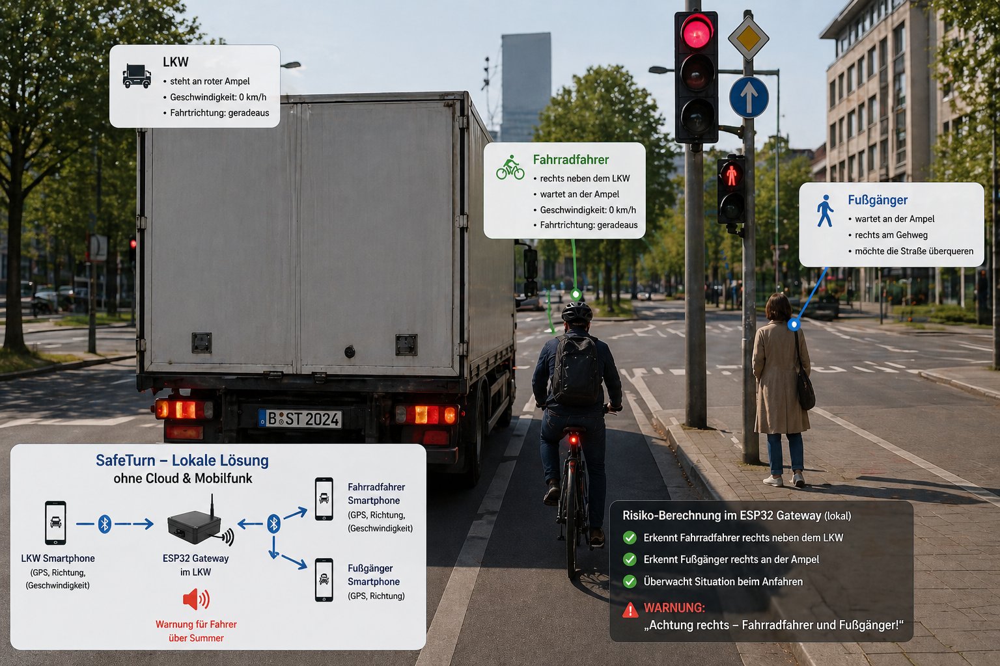
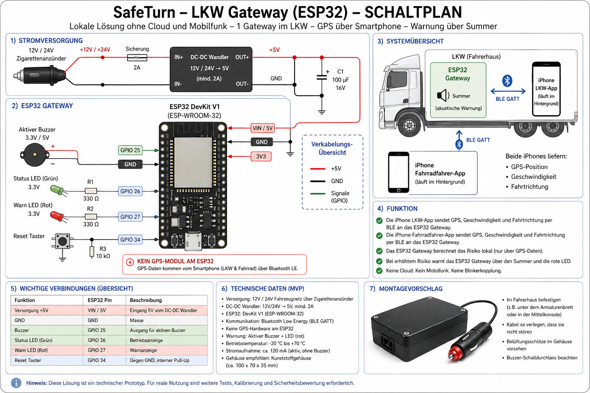

# SafeTurn

**SafeTurn** ist ein technischer Prototyp fuer eine lokale Abbiege- und Totwinkel-Warnung im LKW.

Ziel der ersten Version: Ein LKW steht oder faehrt langsam, ein Fahrradfahrer befindet sich rechts neben oder rechts hinter dem Fahrzeug. Zwei Smartphones liefern GPS-Position, Geschwindigkeit und Fahrtrichtung lokal per Bluetooth Low Energy an ein ESP32-Gateway im LKW. Das ESP32-Gateway berechnet das Risiko lokal und warnt den Fahrer ueber einen Summer.

> Status: MVP / Proof of Concept. Nicht fuer den produktiven Strassenverkehr zugelassen.



## Kernidee

```text
iPhone im LKW                         iPhone am Fahrrad
GPS, Geschwindigkeit, Richtung         GPS, Geschwindigkeit, Richtung
        |                                      |
        | BLE GATT                             | BLE GATT
        v                                      v
                 ESP32-Gateway im LKW
                 - kein GPS-Modul
                 - keine Cloud
                 - kein Mobilfunk
                 - lokale Risikoberechnung
                 - lokaler Summer / Warn-LED
```

## Aktueller MVP-Umfang

- Ein ESP32-Gateway im LKW, Stromversorgung ueber USB / Zigarettenanzuender.
- Kein GPS-Modul am ESP32: GPS kommt vom Smartphone im LKW und vom Smartphone am Fahrrad.
- Keine Cloud, kein Webserver, kein Mobilfunk, kein Internet.
- Keine Blinkerkopplung und keine Blinker-Taste.
- Lokale Warnung im LKW ueber aktiven Summer und Warn-LED.
- iPhone-Fahrer-App mit minimalem Start-/Statusbildschirm; danach Hintergrundbetrieb.
- iPhone-Fahrradfahrer-App mit minimalem Start-/Statusbildschirm; danach Hintergrundbetrieb.
- Optionale Android-Fahrradfahrer-App als BLE-Advertiser fuer spaetere Tests.

## Warum nicht nur Smartphone-App?

Ohne Beacon, UWB oder Gateway koennen sich zwei Smartphones nicht lokal, robust und automatisch genug fuer diesen Anwendungsfall erkennen. Das ESP32-Gateway dient als lokaler Knoten im LKW. Es empfaengt GPS-Daten der beteiligten Apps, berechnet das Risiko und gibt eine lokale akustische Warnung aus.

## Ordnerstruktur

```text
.
├── README.md
├── LICENSE
├── docs/
│   ├── 01_EINLEITUNG.md
│   ├── 02_TECHNISCHE_BESCHREIBUNG.md
│   ├── 03_HARDWARE_UND_SCHALTPLAN.md
│   ├── 04_BLE_PROTOKOLL.md
│   ├── 05_RISIKOALGORITHMUS.md
│   ├── 06_TESTPLAN.md
│   ├── 07_DATENSCHUTZ_UND_SICHERHEIT.md
│   ├── 08_LIMITATIONEN.md
│   ├── 09_ROADMAP.md
│   └── images/
├── firmware/
│   └── esp32-gateway/
├── mobile/
│   ├── ios-driver/
│   ├── ios-cyclist/
│   └── android-cyclist-optional/
└── protocol/
    └── PROTOCOL.md
```

## Schnellstart: ESP32-Gateway

Voraussetzung: PlatformIO.

```bash
cd firmware/esp32-gateway
pio run
pio run -t upload
pio device monitor
```

Standard-Pins:

| Funktion | ESP32 Pin |
|---|---:|
| Aktiver Summer | GPIO 25 |
| Status-LED gruen | GPIO 26 |
| Warn-LED rot | GPIO 27 |
| Reset-/Testtaster optional | GPIO 34 |

## Schnellstart: iPhone-Apps

Die iOS-Apps sind als SwiftUI/CoreBluetooth/CoreLocation-Quellcode vorbereitet.

Empfohlenes Vorgehen:

```text
1. In Xcode ein neues iOS-App-Projekt erstellen.
2. Dateien aus mobile/ios-driver/SafeTurnDriver/ bzw. mobile/ios-cyclist/SafeTurnCyclist/ uebernehmen.
3. Bundle Identifier setzen.
4. Signing Team setzen.
5. Auf echten iPhones testen, nicht nur im Simulator.
```

Alternativ liegen `project.yml`-Dateien fuer XcodeGen bei:

```bash
cd mobile/ios-driver
xcodegen generate
open SafeTurnDriver.xcodeproj
```

```bash
cd mobile/ios-cyclist
xcodegen generate
open SafeTurnCyclist.xcodeproj
```

## Demo-Ablauf

```text
1. ESP32 flashen und ueber USB/Zigarettenanzuender versorgen.
2. iPhone im LKW: SafeTurnDriver starten und Berechtigungen erteilen.
3. iPhone am Fahrrad: SafeTurnCyclist starten und Berechtigungen erteilen.
4. Beide Apps verbinden sich per BLE mit dem ESP32-Gateway.
5. Beide Apps senden GPS, Geschwindigkeit und Fahrtrichtung.
6. ESP32 prueft Abstand, relative Lage rechts und Bewegungsrichtung.
7. Bei Risiko: Summer + rote LED im LKW.
```

## Schaltplan



## Wichtiger Sicherheitshinweis

SafeTurn ist aktuell ein Forschungs- und Entwicklungsprototyp. Er darf nicht als Ersatz fuer Spiegel, Schulterblick, gesetzlich vorgeschriebene Assistenzsysteme, Fahrerpflichten oder zugelassene Fahrzeugtechnik eingesetzt werden. GPS kann in Staedten mehrere Meter abweichen. Der MVP ist nur fuer Labor, Betriebshof und abgesperrte Testflaechen vorgesehen.

## Naechste sinnvolle Schritte

1. Hardware am Tisch testen: ESP32 + Summer + iPhone-Verbindung.
2. GPS-Datenfluss testen: LKW-iPhone und Fahrrad-iPhone senden an ESP32.
3. Risikoalgorithmus mit aufgezeichneten Testpositionen kalibrieren.
4. Betriebshof-Test bei niedriger Geschwindigkeit.
5. Optional: BLE-RSSI als Zusatzsignal ergaenzen.
6. Optional: UWB oder zusaetzliche Sensoren fuer bessere Seitenbestimmung.

## Lizenz

MIT License. Siehe [LICENSE](LICENSE).
